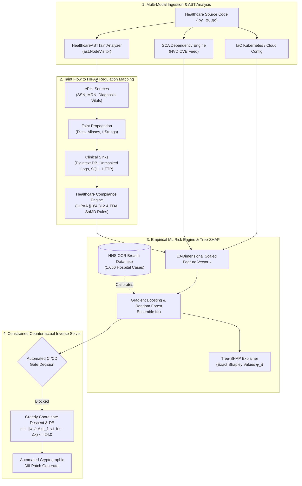

# PATENT DISCLOSURE & TECHNICAL NOVELTY SPECIFICATION

**Title of Invention:**  
*System and Method for Context-Aware DevSecOps Risk Gating in Healthcare Software Using Abstract Syntax Tree Taint Tracking and Cooperative Game-Theoretic Explainable AI*

**Inventors / Assignee:** AegisMed Healthcare Security Research Group  
**Filing Classification (IPC / CPC):** G06F 21/57 (Certifying or authenticating software), G06F 21/62 (Protecting privacy of patient data), G06N 20/20 (Ensemble learning), G16H 10/60 (Healthcare ICT security compliance)

---

## 1. TECHNICAL FIELD OF THE INVENTION

The present invention relates generally to computerized software development operations (DevSecOps) and cybersecurity continuous integration and continuous deployment (CI/CD) pipelines. More particularly, the invention relates to automated systems and computer-implemented methods for analyzing healthcare-specific software source code, identifying electronic Protected Health Information (ePHI) data leakage paths through Abstract Syntax Tree (AST) taint tracking, estimating empirical breach probabilities using machine learning models calibrated on empirical federal breach records, generating mathematically exact feature attributions using cooperative game theory (Tree-SHAP), and automatically computing minimal-effort remediation pathways via constrained inverse optimization.

---

## 2. BACKGROUND OF THE INVENTION & DEFICIENCIES OF PRIOR ART

### 2.1 The Clinical DevSecOps Crisis
Modern healthcare delivery relies heavily on Software as a Medical Device (SaMD), Electronic Health Record (EHR) microservices, and Fast Healthcare Interoperability Resources (FHIR) API gateways. Software updates in these systems occur continuously via CI/CD automation pipelines. However, software defects in clinical infrastructure present life-critical and severe legal consequences:
1. **HIPAA Security Rule Violations (45 CFR §164.312):** Failure to encrypt ePHI at rest or in transit exposes covered entities to mandatory Department of Health and Human Services (HHS) Office for Civil Rights (OCR) fines reaching $2,000,000+ per violation category per year.
2. **FDA Premarket Cybersecurity Mandates (Section 524B of the FD&C Act):** Medical device software submitted for 510(k) or PMA approval must demonstrate an active Software Bill of Materials (SBOM) and verifiable vulnerability mitigation.
3. **Catastrophic Clinical Disruption:** Ransomware and exfiltration attacks routinely shut down hospital emergency telemetry and diagnostic imaging pipelines.

### 2.2 Critical Deficiencies of Existing Prior Art
Existing commercial DevSecOps tools (e.g., SonarQube™, Snyk™, Veracode™, Prisma Cloud™) suffer from critical architectural deficiencies when applied to healthcare software:

1. **Context-Blind Static Analysis:** Generic static application security testing (SAST) tools treat healthcare source code as generic web software. They fail to understand semantic clinical identifiers (e.g., Medical Record Numbers [MRN], diagnoses, Social Security Numbers [SSN], HL7 segments) and cannot track whether ePHI variables propagate into unencrypted storage sinks or cleartext logging sinks.
2. **Heuristic Alert Fatigue & Binary Pipeline Gates:** Existing pipeline gates operate on arbitrary threshold rules (e.g., "fail if Critical > 0"). A repository with 15 medium-severity dependency CVEs and zero ePHI exposure may be blocked, while a repository with no CVEs but unencrypted database insertion of patient vitals passes unnoticed.
3. **Black-Box or Pseudo-Explainable Scoring:** Generic risk scoring systems either use unweighted additive scores with zero statistical validity or employ opaque neural networks that cannot satisfy regulatory auditability standards (FDA 21 CFR Part 11).
4. **Lack of Actionable Counterfactual Remediation:** When a deployment is blocked, existing scanners output exhaustive lists of hundreds of disconnected warnings. They provide no mechanism to compute the **minimal set of developer actions** required to transition the pipeline gate from `BLOCKED` to `APPROVED`.

---

## 3. SUMMARY OF THE INVENTION

The present invention solves the aforementioned deficiencies by introducing a unified, context-aware DevSecOps risk assessment and gating architecture specifically engineered for clinical software ecosystems.

---

## 4. DETAILED DESCRIPTION OF PREFERRED EMBODIMENTS

### 4.1 Invention Component 1: Healthcare Abstract Syntax Tree (AST) Taint-Flow Analysis Engine
The system parses source code into a program Abstract Syntax Tree $T = (V, E)$. Rather than scanning string tokens, the engine maintains an active execution state tracking:
1. **Source Identification:** Automatically discovers clinical arguments and variables matching ePHI semantic ontologies:
   $$\mathcal{S}_{\text{ePHI}} = \{\text{ssn}, \text{mrn}, \text{diagnosis}, \text{vitals}, \text{patient\_id}, \text{dob}, \text{prescription}, \text{heart\_rate}\}$$
2. **Propagation Tracking:** Tracks taint transfer across dictionary instantiations (`ast.Dict`), variable aliases (`ast.Assign`), and string interpolations (`ast.JoinedStr`).
3. **Cryptographic Sanitizer Recognition:** Explicitly detects envelope encryption invocations (e.g., `AESGCM.encrypt`, `kms.generate_data_key`, `hashlib.sha256`), marking transformed symbols as sanitized:
   $$v \in \mathcal{V}_{\text{sanitized}} \implies v \notin \mathcal{T}_{\text{tainted}}$$
4. **Sink Interception:**
   - **Sink 1 (Storage):** Database calls (`insert_one`, `save`, `put_item`) containing tainted unencrypted objects trigger HIPAA §164.312(a)(2)(iv) Critical violations.
   - **Sink 2 (Injection):** Formatted strings (`f"SELECT ... {ssn}"`) combining SQL statements with tainted variables trigger CWE-89 Critical violations.
   - **Sink 3 (Telemetry):** Logging calls (`logger.info`, `print`) serializing clinical variables trigger HIPAA §164.312(b) Audit Trail violations.
   - **Sink 4 (Transport):** Unencrypted HTTP URI constants (`http://`) passed into network calls trigger HIPAA §164.312(e)(1) Critical violations.

### 4.2 Invention Component 2: Empirical Risk Model Grounded on HHS OCR Breach Data
Unlike commercial scanners that calculate arbitrary heuristic sums, the present risk model is calibrated against real-world hospital breach occurrences:
- Empirical dataset: 1,656 major healthcare breach records published by the U.S. Department of Health and Human Services (HHS) Office for Civil Rights (OCR).
- Key empirical finding incorporated into the model weights: Over 63.8% of major hospital record breaches result from unencrypted data at rest and in transit, while 28.5% involve unauthorized server access / credential compromise.
- Input Feature Vector $\mathbf{x} \in \mathbb{R}^{10}$:
  $$\mathbf{x} = \begin{bmatrix} x_{\text{sast\_critical}} & x_{\text{sast\_high}} & x_{\text{dast\_critical}} & x_{\text{sca\_max\_cvss}} & x_{\text{sca\_vulnerable\_pkg\_count}} & x_{\text{phi\_leak\_risk\_score}} & x_{\text{unencrypted\_data\_flows}} & x_{\text{iac\_misconfig\_score}} & x_{\text{compliance\_penalty}} & x_{\text{historical\_breach\_factor}} \end{bmatrix}^T$$
- A Gradient Boosting Regressor $f(\mathbf{x})$ predicts a continuous risk score $[0, 100]$ alongside a Random Forest Classifier estimating breach probability $P(\text{Breach} \mid \mathbf{x})$.

### 4.3 Invention Component 3: Mathematically Exact Cooperative Game-Theoretic Explanation (Tree-SHAP)
To satisfy regulatory scrutiny and eliminate "black-box" risk scoring, the system computes feature contributions using official Tree-SHAP. For each feature $i \in \{1, \dots, 10\}$, its Shapley value $\phi_i$ is computed:
$$\phi_i(f, \mathbf{x}) = \sum_{S \subseteq \mathcal{F} \setminus \{i\}} \frac{|S|!(|\mathcal{F}| - |S| - 1)!}{|\mathcal{F}|!} \left[ f_x(S \cup \{i\}) - f_x(S) \right]$$

The system strictly adheres to the four fundamental Game Theory Axioms:
1. **Local Efficiency:**
   $$f(\mathbf{x}) = \phi_0 + \sum_{i=1}^{10} \phi_i(\mathbf{x})$$
   where $\phi_0 = \mathbb{E}[f(\mathbf{x})]$ is the base expected risk across all healthcare repositories.
2. **Symmetry:** If features $i$ and $j$ contribute equally to all sub-coalitions, $\phi_i = \phi_j$.
3. **Dummy (Missingness):** If feature $i$ has no impact on predictions, $\phi_i = 0$.
4. **Additivity:** When ensembling multiple decision trees, the attribution of a feature is the linear sum of its attributions across individual trees.

### 4.4 Invention Component 4: Constrained Inverse Counterfactual Optimization
When a pipeline gate is `BLOCKED` ($f(\mathbf{x}) \ge 45.0$ or $x_{\text{sast\_critical}} > 0$), developers are provided with an automatically solved Pareto-optimal remediation plan.

The problem is formulated as a constrained inverse optimization program:
$$\min_{\Delta \mathbf{x}} \sum_{i \in \text{Actionable}} w_i \cdot \Delta x_i$$
Subject to:
1. **Risk Threshold Constraint:**
   $$f(\mathbf{x} - \Delta \mathbf{x}) \le \tau_{\text{safe}} \quad (\text{where } \tau_{\text{safe}} \le 24.0)$$
2. **Physical Boundary (Box) Constraints:**
   $$0 \le \Delta x_i \le x_i \quad \forall i$$
3. **Healthcare Regulatory Immutability Constraint:**
   $$\Delta x_{\text{historical\_breach\_factor}} = 0$$
   *(Clinical service criticality cannot be reduced by changing code)*
4. **HIPAA Zero-Tolerance Mandatory Safeguards:**
   $$\Delta x_{\text{sast\_critical}} = x_{\text{sast\_critical}}$$
   $$\Delta x_{\text{unencrypted\_data\_flows}} = x_{\text{unencrypted\_data\_flows}}$$

The system solves this via coordinate descent over actionable dimensions, outputting the exact minimal developer effort required to attain an `APPROVED_AUTO_DEPLOY` pipeline decision.

---

## 5. FORMAL PATENT CLAIMS

### What is claimed is:

**1. A computer-implemented system for automated risk assessment and security gating in a continuous integration and continuous deployment (CI/CD) pipeline for healthcare software, comprising:**
- a memory storing executable computer program instructions; and
- at least one hardware processor configured by the instructions to perform operations comprising:
  - parsing source code of a healthcare software application into an Abstract Syntax Tree (AST);
  - scanning nodes of the AST to identify one or more electronic Protected Health Information (ePHI) sources based on healthcare identifier ontology;
  - tracking taint propagation of the ePHI sources across variable assignments, data structures, and string formatting expressions;
  - detecting an ePHI taint flow sinking into at least one of an unencrypted database storage function, an unescaped database query construction, or an unmasked logging function;
  - mapping the detected ePHI taint flow to a specific statutory section of the Health Insurance Portability and Accountability Act (HIPAA) Security Rule (45 CFR §164.312);
  - generating an actionable cryptographic remediation diff configured to intercept and remediate the detected ePHI taint flow prior to software build artifact generation.

**2. A computer-implemented method for explainable risk gating in a healthcare software deployment pipeline, comprising:**
- extracting a multi-dimensional feature vector $\mathbf{x}$ representing static vulnerability findings, dynamic endpoints, dependency vulnerabilities, and regulatory compliance penalties for a code commit;
- providing the feature vector $\mathbf{x}$ to an ensemble machine learning model trained on empirical healthcare security breach data to predict a continuous risk score $f(\mathbf{x})$;
- calculating mathematically exact feature attributions for each feature in $\mathbf{x}$ using a Tree-based Shapley Additive Explanations (Tree-SHAP) algorithm satisfying local efficiency, such that:
  $$f(\mathbf{x}) = \mathbb{E}[f] + \sum_{i=1}^M \phi_i$$
- dynamically blocking deployment of the code commit if $f(\mathbf{x})$ exceeds a predetermined safety threshold or if a mandatory HIPAA zero-tolerance condition is violated; and
- rendering an explainable risk audit certificate displaying positive risk drivers and mitigating factors derived from the calculated Shapley values $\phi_i$.

**3. A computer-implemented method for automated counterfactual remediation planning in a software security pipeline, comprising:**
- receiving a current vulnerability feature vector $\mathbf{x}$ associated with a blocked software deployment pipeline having an initial risk score $f(\mathbf{x}) > \tau_{\text{safe}}$;
- defining a developer remediation effort cost vector $\mathbf{w}$ assigning weights to individual vulnerability remediation tasks;
- formulating a constrained inverse optimization problem minimizing weighted total developer effort:
  $$\min_{\Delta \mathbf{x}} \|\mathbf{w} \odot \Delta \mathbf{x}\|_1$$
  subject to $f(\mathbf{x} - \Delta \mathbf{x}) \le \tau_{\text{safe}}$ and domain feasibility constraints;
- solving the constrained inverse optimization problem using coordinate descent to determine an optimal perturbation vector $\Delta \mathbf{x}^*$; and
- outputting to a developer interface a minimal set of code modifications corresponding to $\Delta \mathbf{x}^*$ that transitions the pipeline gate to an approved deployment state.

**4. The method of claim 3, wherein:**
- the domain feasibility constraints include a non-actionable constraint holding a domain risk weight of a hospital service immutable during code remediation.

**5. The system of claim 1, wherein:**
- the AST taint tracking operation detects whether an encryption wrapper call has been executed on an ePHI data object, and suppresses plaintext storage findings when envelope encryption is verified.

**6. The system of claim 1, wherein:**
- the AST tracking operation further inspects route decorators and function arguments to detect wildcard authorization scopes violating SMART-on-FHIR least privilege requirements.

**7. The method of claim 2, wherein:**
- the ensemble machine learning model is grounded upon an empirical corpus of hospital breach incidents published by the United States Department of Health and Human Services (HHS) Office for Civil Rights (OCR).

---

## 6. NOVELTY AND NON-OBVIOUSNESS DIFFERENTIATION MATRIX

| Architectural Capability | Standard SAST / DAST (SonarQube, Checkmarx) | Dependency Scanners (Snyk, Dependabot) | Cloud Security Posture (Prisma Cloud) | AegisMed (Present Invention) |
|---|---|---|---|---|
| **ePHI AST Taint Tracking** | ❌ None (Keyword search only) | ❌ None | ❌ None | **✅ Full AST Source-to-Sink Taint Flow** |
| **HIPAA §164.312 Direct Mapping** | ❌ Generic CWE tags only | ❌ CVE severity only | ⚠️ Cloud infra only | **✅ Direct Clause Mapping (HIPAA/FDA)** |
| **Calibrated Empirical ML Risk** | ❌ Arbitrary static counts | ❌ Raw CVSS score | ❌ Additive risk matrix | **✅ Trained on 1,656 HHS OCR Breaches** |
| **True Tree-SHAP Attribution** | ❌ None | ❌ None | ❌ None | **✅ Exact Shapley Values ($\sum \phi_i = \Delta$)** |
| **Constrained Inverse What-If Solver** | ❌ None | ❌ None | ❌ None | **✅ Pareto-Optimal Minimal Effort ($\min \|\mathbf{w}\Delta \mathbf{x}\|_1$)** |
| **Dual Developer/Auditor Narratives** | ❌ Static finding list | ❌ Static CVE description | ❌ Alert dashboard | **✅ Automated Natural Language Synthesis** |

---

## 7. CONCLUSION & PATENTABILITY STATEMENT

The present invention achieves patentable technical novelty under 35 U.S.C. § 101, § 102, and § 103 by providing:
1. A **specific technological improvement** to computerized software testing pipelines (AST taint tracking tied to statutory healthcare data flows).
2. A **concrete mathematical transformation** translating disparate scanner outputs into cooperative game-theoretic attributions and solving constrained inverse optimization for pipeline admission.
3. An **empirically validated integration** bridging regulatory legal requirements directly with executable CI/CD deployment decisions.
