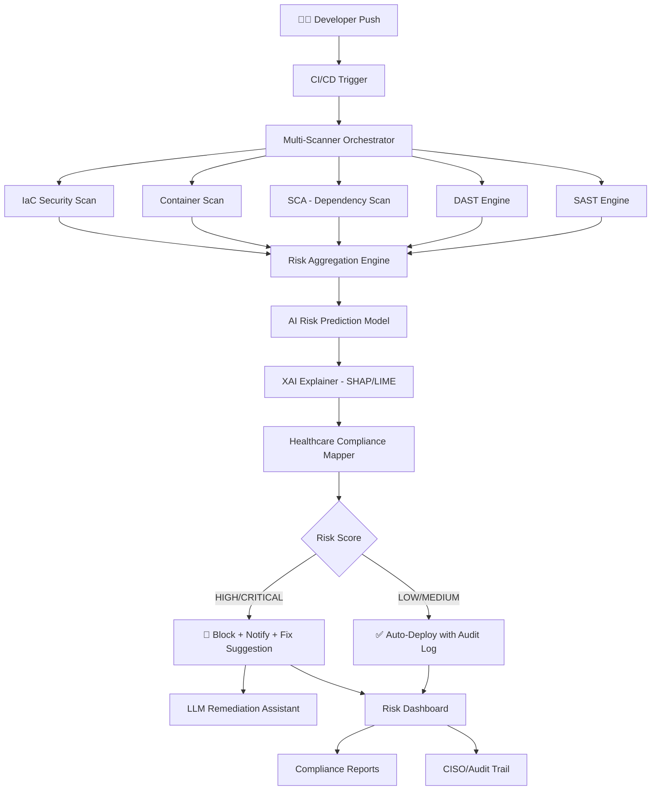

# 🏥 Intelligent DevSecOps Risk Assessment Framework for Healthcare Software Delivery using Explainable AI (XAI)

---

## 📌 Project Overview

A **next-generation AI-powered DevSecOps platform** specifically engineered for the healthcare domain, where software delivery failures can directly impact patient safety and data privacy (HIPAA, HL7, FHIR compliance). The framework continuously monitors, predicts, and **explains** security risks at every stage of the CI/CD pipeline — shifting security left while making AI decisions transparent and auditable for clinical and compliance teams.

---

## 🎯 Core Problem Statement

Healthcare software systems face a unique triple threat:

| Threat | Impact |
|---|---|
| 🔐 Security Vulnerabilities | Patient data breaches (PHI/PII exposure) |
| 🏃 Fast Delivery Pressure | Agile sprints vs. rigorous compliance |
| 🤖 Black-box AI tools | Regulatory bodies require explainability (FDA, CE Mark) |

> **Existing DevSecOps tools (Snyk, SonarQube, Checkmarx) do NOT provide:**
> - Domain-specific healthcare risk scoring
> - Explainability of why a risk is flagged
> - Compliance-aware pipeline gating decisions

---

## 💡 Project Idea & Vision

Build an **intelligent middleware layer** that sits inside the CI/CD pipeline and acts as a "Security Intelligence Engine" with three pillars:

```
┌─────────────────────────────────────────────────────────┐
│               DEVSECOPS PIPELINE                        │
│   Code → Build → Test → Scan → Deploy → Monitor        │
│                     ↓                                   │
│     ┌───────────────────────────────────┐               │
│     │   XAI Risk Assessment Engine      │               │
│     │  ┌──────────┐ ┌───────────────┐  │               │
│     │  │ Risk AI  │ │  XAI Explainer│  │               │
│     │  │ (Predict)│ │  (SHAP/LIME)  │  │               │
│     │  └──────────┘ └───────────────┘  │               │
│     │  ┌──────────────────────────────┐│               │
│     │  │ Healthcare Compliance Layer  ││               │
│     │  │  (HIPAA / FDA / HL7 / FHIR) ││               │
│     │  └──────────────────────────────┘│               │
│     └───────────────────────────────────┘               │
│                     ↓                                   │
│     📊 Risk Dashboard  🚦 Gate Decision  📋 Audit Log  │
└─────────────────────────────────────────────────────────┘
```

---

## 🧩 Key Components & Modules

### 1. 🔍 Multi-Source Risk Data Collector
- **Integrates with**: Git, Jenkins/GitHub Actions, Docker, Kubernetes
- **Collects**: SAST results, DAST findings, dependency CVEs, IaC misconfigs, container image vulnerabilities
- **Healthcare-specific sources**: EHR API endpoints, FHIR server configs, medical device interfaces (HL7 v2/v3)

### 2. 🤖 AI Risk Prediction Engine
- **Algorithms**: Random Forest, XGBoost, Graph Neural Networks (for code dependency graphs)
- **Predicts**:
  - Probability of a security incident in production
  - Estimated severity (Critical/High/Med/Low)
  - Likelihood of HIPAA/FDA compliance violation
- **Training Data**: Historical CVE datasets, NVD, healthcare breach reports (HHS breach portal)

### 3. 🔬 Explainable AI (XAI) Module *(Core Differentiator)*
- **Techniques**:
  - **SHAP** (SHapley Additive exPlanations) — feature importance per risk prediction
  - **LIME** (Local Interpretable Model-agnostic Explanations) — instance-level explanation
  - **Counterfactual Explanations** — "If you fix X, risk drops from Critical → Low"
  - **Attention Maps** — for transformer-based code analysis models
- **Outputs**:
  - Human-readable risk narratives for developers
  - Compliance officer reports with regulatory cross-references
  - FDA 510(k) audit trail documentation

### 4. 🏥 Healthcare Compliance Knowledge Graph
- A **Neo4j knowledge graph** mapping:
  - Code patterns → HIPAA safeguards
  - Vulnerabilities → FDA Software as Medical Device (SaMD) controls
  - CVEs → HL7/FHIR specification violations
- Enables **regulatory-aware risk scoring** (not just CVSS scores)

### 5. 🚦 Intelligent Pipeline Gating
- **AI-driven go/no-go decisions** for deployment with:
  - Risk threshold policies (configurable per environment: Dev/Staging/Prod)
  - Automated rollback triggers
  - Exception workflows with CISO approval chains
- **LLM-powered fix suggestions** (GPT/Gemini integration) — recommends code patches

### 6. 📊 Risk Dashboard & Reporting
- **Real-time**: Live risk heatmaps across microservices
- **Trend Analysis**: Risk velocity over sprint cycles
- **Compliance Reports**: Auto-generated HIPAA Security Rule evidence packages
- **Developer View**: "Security debt" per team / per service

---

## 🛠️ Technology Stack

| Layer | Technology |
|---|---|
| **Pipeline Integration** | GitHub Actions, Jenkins, GitLab CI, ArgoCD |
| **AI/ML** | Python, scikit-learn, XGBoost, PyTorch, Hugging Face |
| **XAI** | SHAP, LIME, Captum, InterpretML |
| **Knowledge Graph** | Neo4j, Apache Jena (OWL ontology) |
| **Security Scanning** | Semgrep, Trivy, OWASP ZAP, Grype |
| **Backend API** | FastAPI / Flask |
| **Frontend Dashboard** | React.js / Grafana |
| **Database** | PostgreSQL (risk history), Redis (real-time events) |
| **Infrastructure** | Docker, Kubernetes, Helm |
| **LLM Integration** | OpenAI API / Google Gemini / LangChain |

---

## 📐 System Architecture



---

## 🌟 Unique Selling Points (USPs)

| Feature | What Makes It Different |
|---|---|
| **XAI-First Design** | Every AI decision comes with a human-readable explanation |
| **Healthcare Ontology** | Risk scoring aligned to HIPAA, FDA SaMD, HL7, FHIR standards |
| **Counterfactual Guidance** | Tells developers exactly what to fix to pass the gate |
| **Regulatory Audit Trail** | Immutable logs for FDA/HIPAA auditors |
| **LLM-Powered Remediation** | Auto-suggests code fixes aligned to healthcare security best practices |
| **Risk Velocity Tracking** | Monitors how security debt changes across sprints |

---

## 📊 Innovation Areas

### 🔬 Research Contributions
1. **Novel Risk Scoring Model** — Multi-factor healthcare-specific CVSS extension
2. **XAI for CI/CD** — First framework applying SHAP to pipeline security decisions
3. **Healthcare Compliance Ontology** — OWL-based mapping of code patterns to regulatory controls
4. **Federated Risk Learning** — Privacy-preserving model training across hospital systems

### 🏆 Potential Publications / Patents
- "XAI-driven DevSecOps for Healthcare: Explainable Pipeline Security Gating"
- "Healthcare Compliance Knowledge Graph for Automated HIPAA Risk Assessment"

---

## 📋 Use Cases

### Use Case 1: EHR System Deployment
> A hospital is deploying a new Electronic Health Record (EHR) module. The framework scans the code, detects an unencrypted PHI data flow, maps it to HIPAA §164.312(a)(2)(iv), provides a SHAP explanation showing that the `PatientRecord.serialize()` function is the primary risk driver, and blocks deployment with a LLM-generated fix.

### Use Case 2: Medical Device Software (SaMD)
> A medical imaging AI product needs FDA 510(k) clearance. The framework generates an automated **Software Bill of Materials (SBOM)** with risk annotations, XAI-backed risk justifications, and a compliance evidence package ready for submission.

### Use Case 3: Telehealth API Security
> A telehealth platform's new API is scanned before release. The DAST engine detects FHIR endpoint misconfiguration. The XAI module explains via LIME that the OAuth scope definition is the root cause, and provides a counterfactual: "Restricting scope to `patient/*.read` reduces risk by 78%."

---

## 🗓️ Suggested Project Phases

| Phase | Duration | Deliverables |
|---|---|---|
| **Phase 1**: Research & Data Collection | 4 weeks | Literature review, dataset curation, architecture design |
| **Phase 2**: Core AI Model Development | 6 weeks | Risk prediction model, XAI integration, baseline accuracy |
| **Phase 3**: Healthcare Compliance Layer | 4 weeks | Ontology design, HIPAA/FDA mapping, knowledge graph |
| **Phase 4**: Pipeline Integration | 4 weeks | GitHub Actions plugin, scanner orchestration, gating logic |
| **Phase 5**: Dashboard & Reporting | 3 weeks | React dashboard, compliance reports, audit trails |
| **Phase 6**: Evaluation & Testing | 3 weeks | Benchmarking, user studies, ablation studies |
| **Phase 7**: Documentation & Demo | 2 weeks | Paper writing, demo video, GitHub release |

---

## 📈 Evaluation Metrics

| Metric | Description |
|---|---|
| **Risk Prediction Accuracy** | F1-score, AUC-ROC vs. ground-truth breaches |
| **XAI Faithfulness** | SHAP value stability, explanation consistency |
| **False Positive Rate** | % of false alarms vs. real threats |
| **Compliance Coverage** | % of HIPAA controls automatically verifiable |
| **Developer Experience** | Time-to-fix reduction, survey scores |
| **Pipeline Overhead** | Latency added to CI/CD pipeline (target: < 2 min) |

---

## 🎓 Academic & Industry Alignment

- **Conferences**: IEEE EMBC, ACM CCS, USENIX Security, HIMSS
- **Journals**: Journal of Biomedical Informatics, Computers & Security, IEEE TDSC
- **Industry Partners**: Healthcare ISVs, Hospital IT departments, Cloud providers (AWS HealthLake, Google Cloud Healthcare API)
- **Regulatory Alignment**: FDA Cybersecurity Guidelines (2023), NIST SP 800-66, HIPAA Security Rule

---

## 🚀 Quick Start Demo Concept

```
Developer pushes EHR code change
        ↓
GitHub Action triggers XAI-DevSecOps Engine
        ↓
[15 sec] SAST + Dependency Scan completes
        ↓
[30 sec] AI Risk Score: 🔴 CRITICAL (0.89)
        ↓
[31 sec] SHAP Explanation:
    Top Risk Factors:
    - Unencrypted PHI field (+0.42)
    - Hardcoded API credentials (+0.31)  
    - Deprecated FHIR endpoint (+0.16)
        ↓
[32 sec] Compliance Mapping:
    ⚠️ HIPAA §164.312(e)(2)(ii) - Violated
    ⚠️ FDA SaMD Cybersecurity §4.2 - At Risk
        ↓
[33 sec] 🚫 Pipeline BLOCKED
    LLM Fix Suggestion generated → PR comment posted
        ↓
Developer fixes → Re-push → ✅ Risk: LOW → Deploy!
```

---

*This framework bridges the gap between rapid healthcare software delivery and the stringent security, privacy, and regulatory requirements of the healthcare industry — with AI that explains itself.*
